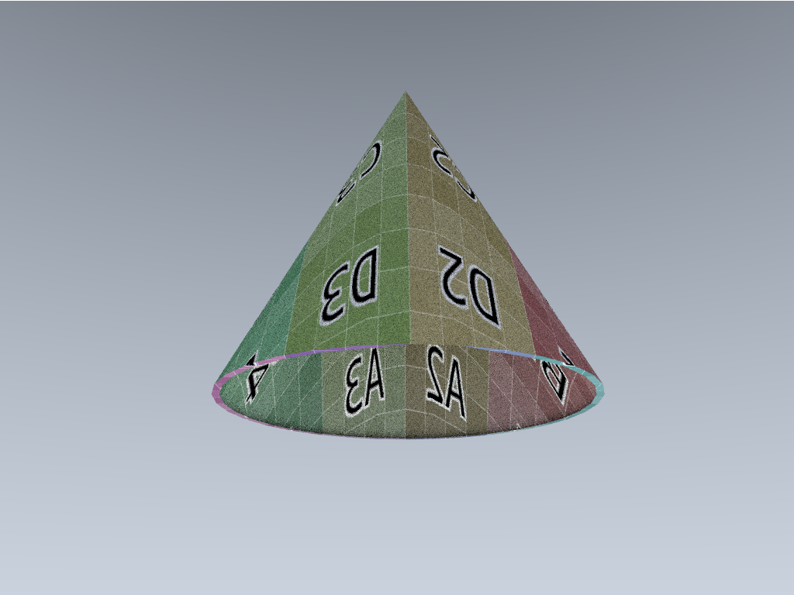

A raytracer implemeted in go - for learning.
References:
[_Ray Tracing in One Weekend_](https://raytracing.github.io/books/RayTracingInOneWeekend.html)

## grpc server
to compile protos and grpc server implementation

```
protoc --go_out=./protos/rtgo/ --go_opt=paths=source_relative --go-grpc_opt=paths=source_relative  --go-grpc_out=./protos/rtgo/  .\protos\rtgo.proto
```

### TODO:
- [x] send rays towards light objects
- [x] specular/refecltive rays for metal etc.
- [x] multicore - samples are split into goroutines, but other strategies are untested
- [x] positionable camera
- [x] BVH or other spatial data structure
- [] specular highlights
- [] update view progress
- [x] ray tri intersection
- [~] obj/stl loading
- [] texture coords / textures
- [] signed distance field to mesh gen using https://github.com/deadsy/sdfx




